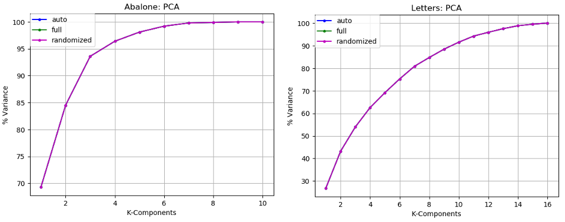
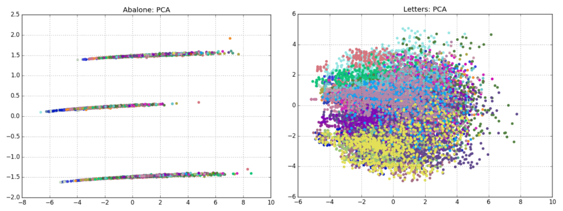
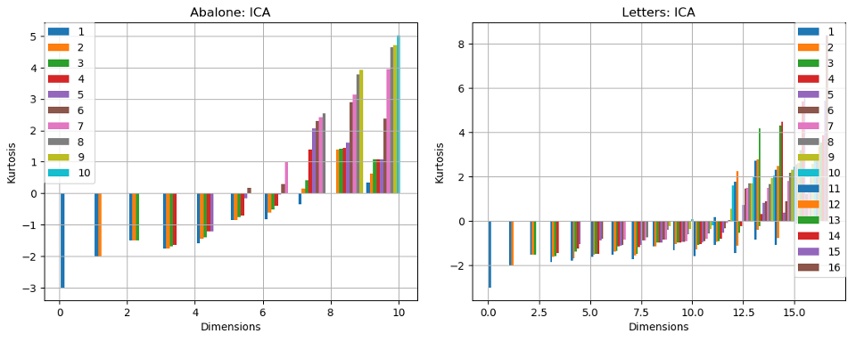
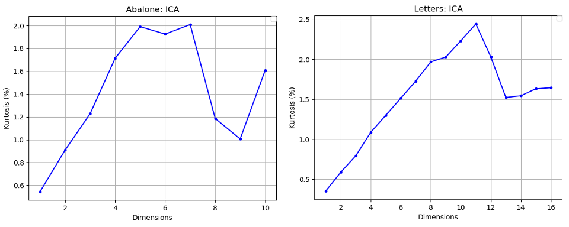
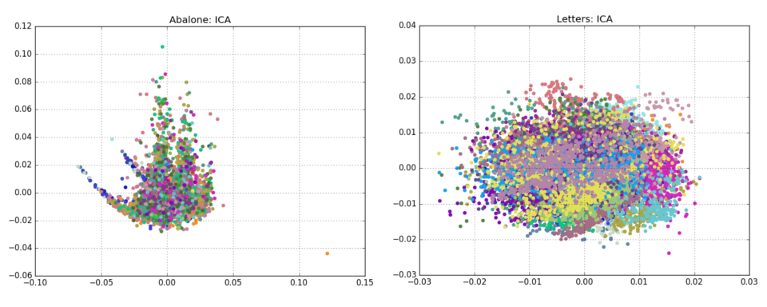
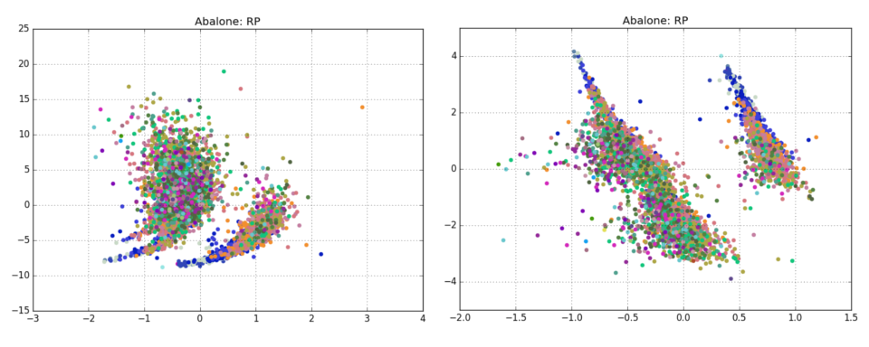
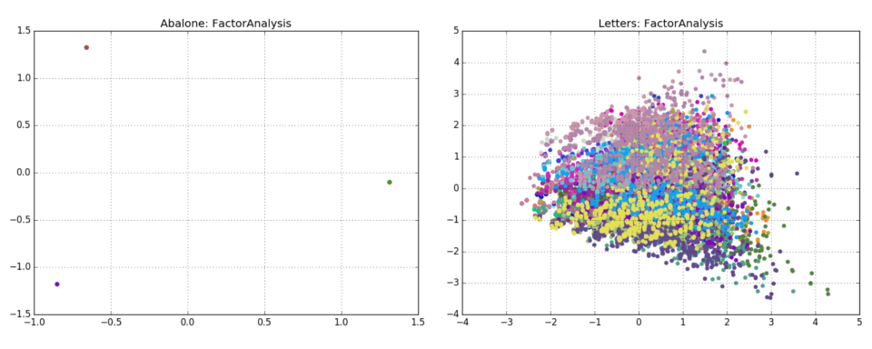
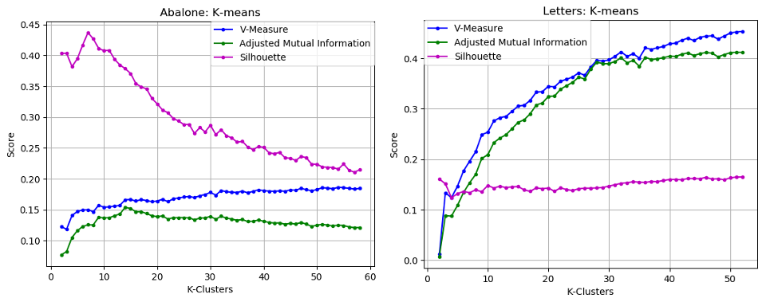

# Unsupervised Learning and Dimensionality Reduction

# Introduction
This report explores two clustering algorithms: k-means and expectation-maximization. It also explores 4 dimensionality reduction algorithms: Principal Component Analysis, Independent Component Analysis, Randomized Projections, and Factor Analysis. Furthermore, the algorithms were applied to a neural network classification problem to draw comparisons on their performance and behaviors.

# Datasets
The code requires the following UCI Machine Learning datasets:

Dataset | Instances | Attributes | Attribute Characterics | Classes
--- | --- | --- | --- | ---
Abalone | 4,177 | 8 | Categorical, Continuous | 29
Letter Recognition | 20,000 | 16 | Integer | 26

#### Abalone Data Set
http://archive.ics.uci.edu/ml/datasets/Abalone
Abalone This dataset addresses a problem within the field of biology; machine learning attempts to identify a mechanism for determining the age of abalone organisms using normalized physical measurements of abalone. Its continuous feature attributes could be used as either in regression or a challenging classification problem.

#### Letter Recognition Data Set
http://archive.ics.uci.edu/ml/datasets/Letter+Recognition
This dataset addresses an interesting real-world problem pertaining to computer vision and modern technology to identify letters based on numerical attributes representing statistical moments and edge counts.


# Requirements
- Python 2.7.12
- numpy 1.13.3
- pandas 0.18.1
- matplotlib.pyplot 1.5.3
- time
- scikit-learn 0.19.1

# The Algorithms

Run these commands within the code directory.

## Principal-Component Analysis
```python
python pca.py
```

Principal component analysis is a feature transformation algorithm that attempts to find a projected transformation of the features that maximizes variance. The transformation axes are the principal component vectors. To determine the optimal number of principal components, the variance is calculated for each component.





## Independent Component Analysis
```python
python ica.py
```

Independent component analysis (ICA) is another feature transformation algorithm that tries to identify the hidden independent features in the dataset that provide no mutual information relative to each other. Finding the optimal number of independent component requires calculating the kurtosis, or the peakedness of a distribution; a value of 3 represents a normal Gaussian distribution. As the number of components changes, the kurtosis of each component also shifts, making it difficult to determine the optimal number of components. The extent to which each number of k-dimensions is non-Gaussian for each component was calculated. 





## Randomized Projections
```python
python rp.py
```

Randomized Projections generates a randomized matrix of a specified dimension that is used to transform the features into another feature space. The number of dimensions was determined by evaluating the reconstruction error of the projected data over multiple iterations: 10, 40, 100 and 200.



## Factor Analysis
```python
python factor.py
```

Factor Analysis is a simple linear generative model with Gaussian latent variables, unlike ICA which uses non-Gaussian latent variables. The optimal number of components was selected using the average log-likelihood of the samples. 



## K-Means
```python
python kmeans.py
```

K-means is a hard-clustering algorithm that partitions data into clusters by first picking k centers at random. Each center claims the data points that are closest to it and recomputes its center by averaging the location of all its points. This process iteratively continues until the data points no longer change cluster.
The value of k was selected using unsupervised learning by analyzing the silhouette coefficient. The charts give a visual representation of the distribution of data points in each cluster, and the individual silhouette coefficients. 



## Expectation-Maximization
```python
python em.py
```

Expectation-Maximization is a soft-clustering algorithm that allows a data point to be shared between many clusters. The data points are assigned k probabilities of that point being in each cluster. The algorithm interactively tries to maximize the likelihood that the data comes from these distributions. The algorithm was implemented using the hyper parameters of kmeans for initializing the weights, means, and precisions; and  a regularization covariance factor  of  1e-2. 
The Bayesian information criterion (BIC) helped determine the optimal number of clusters, which is based on the log-likelihood of the model.


## Neural Network
```python
python neural_network.py
```

Neural networks were implemented to train the clustered and dimensionality-reduced datasets using the same network structure that the original dataset was trained on. For each dimension-reduced dataset, the neural network training time improved, but the extra computational cost of always performing multiple iterations and feature transformations might outweigh the benefits of achieving a higher score on occasion.
